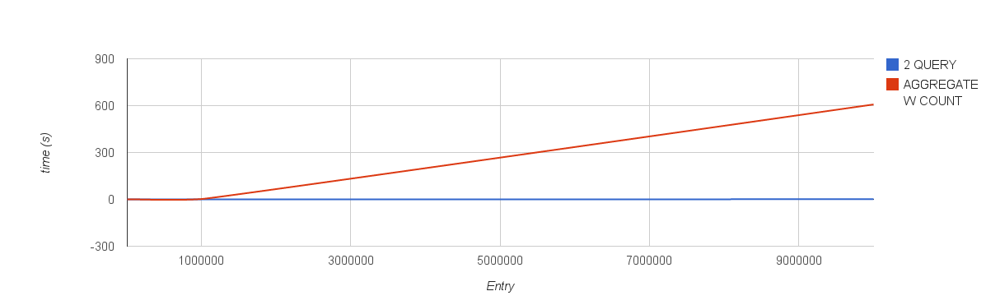
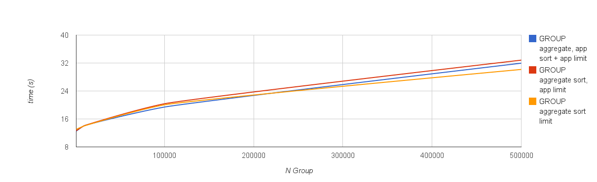

===========
Aggregation
===========

Abstract
========

Nel seguente documento si riportano i risultati delle analisi, simulazioni e
benchmarking delle query di aggregazione fornite e dei tweaking proposti

Introduzione
============

Il comando *explain* utilizzato sulle operazioni di aggregazione non fornisce
un dato sul tempo di esecuzione della query, per questo si è scelto di
utilizzare il profiler di mongodb per calcolare i tempi di esecuzione.
Purtroppo il profiler non è supportato per mongos, quindi, per effettuare dei
benchmark e dei confronti nell'ambiente di test è stato utilizzato un tool
esterno che va a leggere dai profiler dei singoli nodi.
(https://github.com/ajdavis/cluster-profile)

Risposte a dubbi ed analisi aggregazione
========================================

    * Per quanto riguarda il dubbio sull' ordine delle operazioni in pipeline: Un sort
      sul time prima della group avrà il benificio di usare gli indici per cui avrebbe
      molto senso farlo, se fatta dopo la group non utilizzerà gli indici per cui sarà
      sicuramente più lenta.
    * Per quanto riguarda la possibilità di inserire la ``sort`` prima di una ``group``
      all'interno di una pipeline: Il funzionamento della group di mongodb non è in realtà
      un'effettivo raggruppamento nel senso classico, ma il comportamento dipende dalla
      funzione associata. Quindi non beneficia particolarmente dall'adiacenza degli elementi
      simili. In ogni caso l'output della group non è stabile, quindi non mantiene
      eventuali ordinamenti precedentemente fatti.
    * Per quanto riguarda l'efficienza di fare 2 query ``count`` + ``aggregate`` per
      paginare una aggregazione (avendo quindi il count totale dei risultati) sono state
      fatte varie prove visibili nella sezione :ref:`paginate`.
    * Per quanto riguarda l'efficienza di effettuare il raggruppamento usando ``aggregate``
      e poi sortare e limitare applicativamente si può fare riferimento alla sezione
      :ref:`group-paginate`.

.. _paginate:

Paginazione in Aggregation VS 2 Query
-------------------------------------

La soluzione che permetterebbe di unificare il processo di conteggio con quello
di ritorno dei risultati sarebbe quella basata sull'aggregation framework.

Sfruttando ``$group`` è possibile contare i risultati totali e poi limitarli::

    db.measures.find({'idDataset' : 2, 'datasetVersion' : 1, 'time': {'$lt': ISODate("2014-10-02T14:00:00Z")}}).count()
    db.measures.find({'idDataset' : 2, 'datasetVersion' : 1, 'time': {'$lt': ISODate("2014-10-02T14:00:00Z")}}).limit(10)

VS::

    db.measures.aggregate([
        {'$match': {'idDataset' : 2, 'datasetVersion' : 1, 'time': {'$lt': ISODate("2014-10-02T14:00:00Z")}}},
        {'$group': {'_id': 'results', 'total': {'$sum': 1}, 'results': {'$push': '$$CURRENT'}}},
        {'$unwind': '$results'},
        {'$limit': 10}
    ])

Tuttavia come si può vedere al grafico questa soluzione è sicuramente più
inefficiente:

Questo è dovuto al fatto che MongoDB può effettuare le operazioni di `count`
sfruttando i contatori scritti direttamente nei BTree degli indici. Quindi se
la query include un indice è molto veloce effettuarne l'operazione di conteggio.

In ogni caso, anche se la query non fosse indicizzata, per portare dietro il set
di risultati e poi poterlo limitare è necessario ricorrere alla chiamata ``$push``
che effettuando l'inserimento in un *array dinamico in memoria* richiede la riallocazione
dell'array per gli inserimenti.

.. _group-paginate:

Paginazione con $group
----------------------

Al momento l'applicazione esegue lato MongoDB solo la ``$group``, poi sul
risultato viene effettuato *ordinamento*, *conteggio* e *limit* lato applicativo.

.. note::

    Non è chiaro perché l'ordinamento avvenga lato applicativo, esso potrebbe
    essere introdotto nella pipeline di aggregazione con ``$sort`` in modo da lasciare
    lato applicativo solo il *conteggio* e *limit*.

Sfruttando lo stesso procedimento precedente, è possibile unificare in una sola
query il conteggio, raggruppamento e limite.

La query::

    db.measures.aggregate([
        {'$group': {'_id': '$value', count: {'$sum': 1}}}
    ])

che successivamente ordinerebbe, conterebbe e limiterebbe lato applicativo può essere
facilmente estesa per effettuare l'ordinamento nella pipeline di aggregazione direttamente::

    db.measures.aggregate([
        {'$group': {'_id': '$value', count: {'$sum': 1}}},  # Questo è l'effettivo raggruppamento
        {'$sort': {'_id': 1}},  # Ordina i risultati lato MongoDB invece di farlo applicativamente
    ])

Inoltre si può sperimentare nuovamente di effettuare l'operazione di conteggio e limit
direttamente lato aggragazione::

    db.measures.aggregate([
        {'$group': {'_id': '$value', count: {'$sum': 1}}},  # Questo è l'effettivo raggruppamento
        {'$sort': {'_id': 1}},  # Ordina i risultati lato MongoDB invece di farlo applicativamente
        {'$group': {'_id': null, 'results': {'$push': '$$CURRENT'}, 'total': {'$sum': 1}}},
        {'$unwind': '$results'},
        {'$limit': 10}
    ])

In questo caso possiamo tenere alcune considerazioni:

    * Al fine di inviare i risultati nel lato applicativo il cursore dovrà essere srotolato
      e quindi il costo è lineare al numero di risultati, uguale all'operazione lato server
      di ``$group``.
    * Al fine di ricostruire il set dei dati ricevuti lato applicativo i dati dovranno essere
      inseriti uno ad uno in un contenitore dal driver mongodb, nuovamente una operazione di
      complessità lineare al pari della ``$unwind``.
    * Il costo della ``$push`` nella group potrebbe essere equivalente al costo dell'inserimento
      dei risultati nell'array che li conterrà lato applicativo, quindi dipendentemente dal
      container usato lato applicativo potrebbe risultare parimenti veloce.
    * Nel caso in cui il set di risultati venga interamente passato all'applicazione c'è da
      considerare il costo di trasmissione. Questo è notevolmente ridotto nel caso dell'aggregazione
      in cui invece sono passati solo i 10 risultati già limitati.

Di seguito il risultato dei benchmark nei tre casi:

    * Sort + Count + Limit applicativi (simulati con script python)
    * Count + Limit applicativi (simulati con script python)
    * Solo pipeline

Dal grafico si evince in modo interessante che al crescere dei gruppi, il costro
di trasferimento e del driver mongodb supera sensibilmente il guadagno ottenuto dall'eliminazione
dei processi di ``$group``, ``$push`` e ``$unwind``. Quindi ne caso in cui ci siano
centinaia di migliaia di gruppi diversi la soluzione intermanete in pipeline risulta più
efficiente.

Nei casi con bassi numero di gruppi invece la soluzione che effettua le operazioni in app
è più efficiente, ma la differenza non sembra così rilevante (uno scarto dell'**1%**).

Best Practices
==============

Il processo di aggregazione avviene in parte all' interno del nodo contenente i
dati e in parte dal nodo principale (se si utilizza almeno mongodb 2.6,
altrimenti dal mongos).

Mongodb in automatico cerca di ordinare le operazioni all' interno della
pipeline in modo da utilizzare gli indici e da renderle il più ottimizzate
possibile, in ogni caso quando si scrive la pipeline di esecuzione è sempre
meglio tenere in considerazione alcuni accorgimenti:

    * Nella pipeline di aggregazione mettere sempre al primo posto *match* di campi
      indicizzati (``idDataset``, ``datasetVersion``, ``time``) in modo che sia
      toccato solo il nodo contenente effettivamente i dati.
    * Immediatamente dopo è bene inserire *sort* su campi indicizzati(``idDataset``,
      ``datasetVersion``, ``time``)
    * Una volta fatti *match* e *sort* indicizzati vanno fatti gli altri match e gli
      altri sort
    * In ogni caso le operazioni di *sort* e *group* vengono eseguite direttamente
      nei vari nodi impattati, successivamente vengono inviati i risultati al nodo
      principale (o al mongos in caso di versione < 2.6) per essere mergiati e
      procedere la pipeline, per questo è sempre meglio metterle in cima alla
      pipeline di esecuzione
    * Se ho eseguito un *sort* e poi necessito di fare *min* o *max* sul campo è
      sempre meglio utilizzare *first* e *last*, se invece non sorto *min* e *max*
      sono migliori di *sort* + *first* o *last*

Opzioni
-------

Di seguito sono riportate le opzioni che più comunemente influenzano l'aggregation framework.
Esse possono essere passate direttamente alla chiamata ``.aggregate`` per cambiarne
il comportamento:

    * **allowDiskUse**: Nel caso in cui le operazioni in pipeline siano molto pesanti
      o processimo molti dati potrebbe essere necessario abilitare questa opzione in
      quanto il massimo di RAM utilizzata per le pipeline di aggragazione è di 100MB,
      questo permette di utilizzare il disco e superare questo limite.
    * **cursor**: cursor: { batchSize: 0 } significa che il il primo batch sarà vuoto
      e tornerà un cursore con all' interno l'errore se presente, con questa pratica
      si può verificare la presenza di errori senza caricare il server di lavoro.
