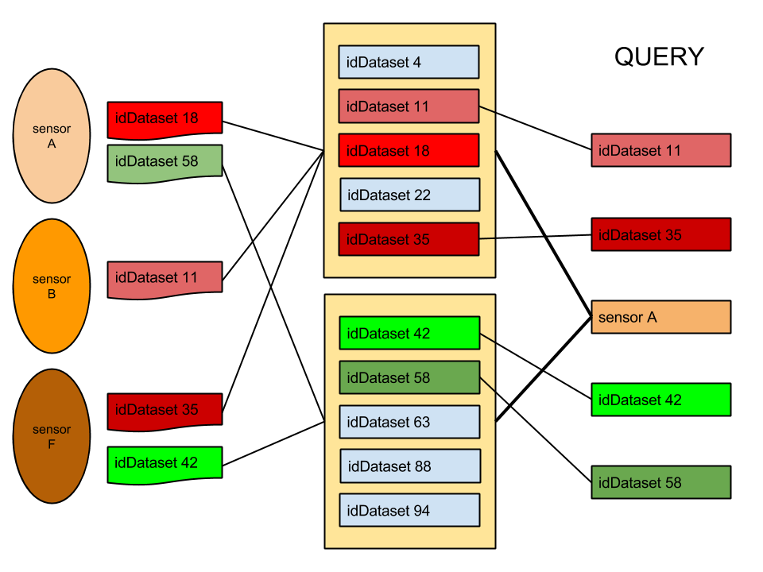
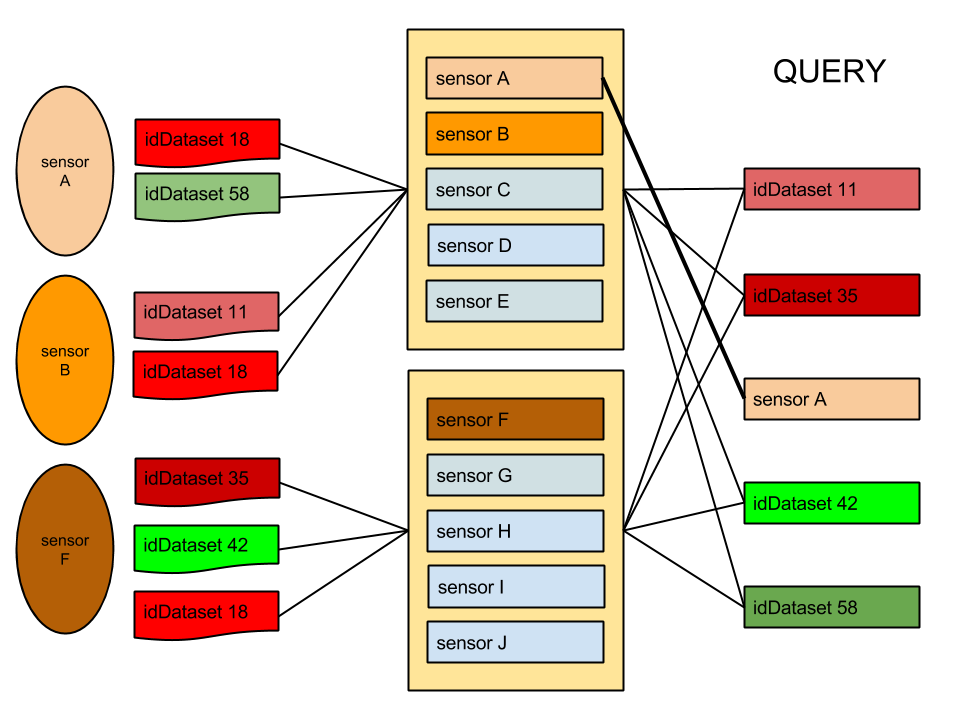
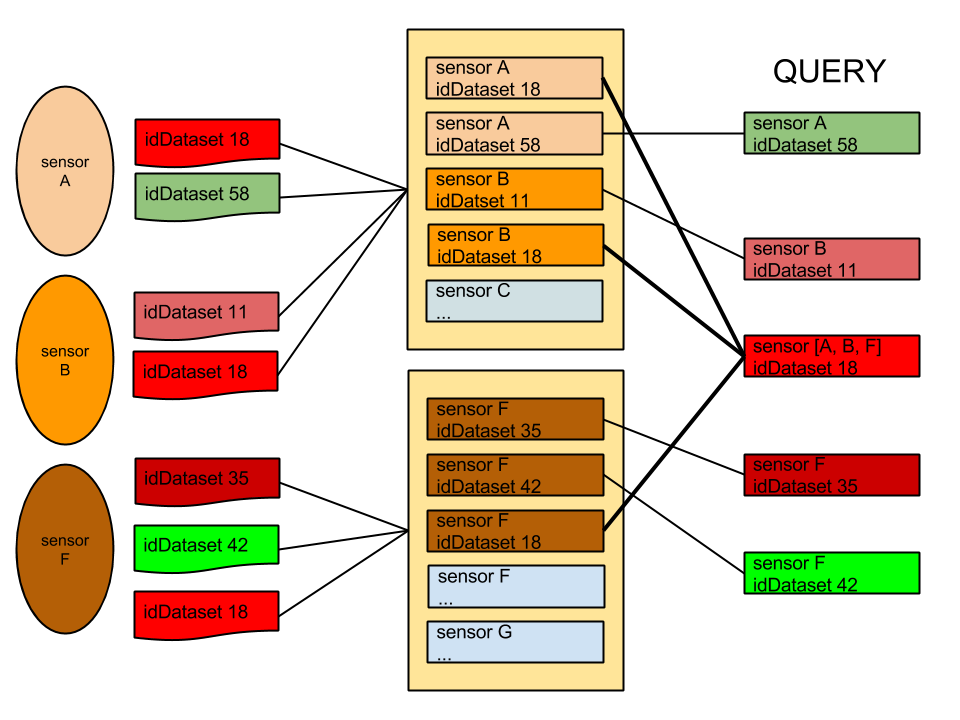

======================
Collections Shard Keys
======================

Abstract
========

Nel seguente documento si riportano i risultati delle analisi, simulazioni e
benchmarking dell'infratruttua mongoDB del SDP per fare una scelta ponderata
sulle Shard Key.

Introduzione
============

Per prendere in considerazione le giuste Shard Key del sistema, in modo da
avere una sistuazione ottimale rispetto ai casi d'uso presunti, si sono eseguiti
dei  benchmark e delle simulazioni sull'ambiente vagrant che rispecchia in toto
l'attuale configurazione dell'ambiente dello SmartDataPlatform.

L'incertezza dello scenario di utilizzo rende difficile una sola e definitiva
scelta, ma vengono riportate di seguito quattro soluzioni di cui 2  consigliate,
con pro e contro di ogni soluzione.

L'analisi viene eseguita sull'attuale collection `Measures` e l'attuale
collection `Data`.

Shard Keys Collection Measures
==============================

Per fare in modo che il router mongos divida i chunk di dati in modo efficente
tra le varie shard, le 4 Shard Keys possibili sono:

* ``idDataset`` + ``datasetVersion``
* ``idDataset`` + ``datasetVersion`` + ``time``
* ``sensor``
* ``sensor`` + ``idDataset`` + ``datasetVersion``

Per quanto riguarda il campo ``streamCode`` non possiede abbastanza cardinalità
ed unicità per poter essere scelto come Shard Key

``idDataset`` + ``datasetVersion``
==========================

Allo stato attuale delle cose, viste le query fornite o comunque utilizzando
query basate su ``idDataset``, questa è sicuramente la Shard Key che permette di
raggiungere le performance più elevate in lettura.

La chiave è composta con ``datasetVersion`` semplicemente per facilitare le query di
lettura

Per quanto riguarda la scritturà invece, avere ``idDataset`` incrementale potrebbe
portare al sovraccarico della shard contenente la maxKey ogniqualvolta viene
aggiunto un nuovo stream;
Inoltre se il numero di stream non è abbastanza elevato si potrebbero presentare
dei jumbo chunks per la bassa cardinalità di ``idDataset``

pros:

    * Best Throughput in lettura (query attuali o query basate su ``idDataset``)
    * Best Throughput in scrittura se 1 sensore -> 1 stream

cons:

    * Worst Throughput in lettura per sensore
    * jumbo chunks per indivisibilità dell'insieme
    * sovraccarico shard maxKey in aggiunta nuovo stream

Nello schema ``datasetVersion`` è ignorato per chiarezza dello stesso.

``idDataset`` + ``datasetVersion`` + ``time``
=================================

Le considerazioni sono esattamente le stesse di ``idDataset`` + ``datasetVersion``,
``time`` serve per aiutare la shard a dividere in più chunk i dati ed avere più
granularità, inoltre agevola le query su un range di tempo o che includono ``time``

pros:

    * vedi ``idDataset`` + ``datasetVersion``
    * granularità massima data dalla Shard Key composta con ``time``
    * query su campo ``time`` agevolate
    * maggior randomicità della shard se ``idDataset`` random

cons:

    * vedi ``idDataset`` + ``datasetVersion``

``sensor``
======

Attualmente questa è la Shard Key peggiore in lettura basandosi sulle query
fornite o comunque su query basate su ``idDataset``, in quanto, non si avrà mai
idea  del chunk in cui si trovano i dati e dovrà essere interrogato tutto il
cluster, è invece la Shard Key migliore per le query su ``sensor``.

Per quanto riguarda la scrittura invece, questa sarebbe la shard key ottimale
nel caso in cui ci siano molti stream alimentati da molti sensori, evitando il
sovraccarico di alcuni chunk (come nel caso in cui si utilizzi ``idDataset`` come
Shard Key);

d'altra parte, nel caso in cui la differenza della frequenza di invio dei dati
tra vari sensori sia molto elevata, si verificherà comunque il sovraccarico.

pros:

    * Best Throughput in scrittura se si verifica spesso N sensori - > 1 stream
    * Best Throughput in lettura per query basate su ``sensor``

cons:

    * Sovraccarico della shard per i sensori con frequenza maggiore
    * Worst Throughput in lettura per query attuali (isDataset)
    * jumbo chunks per indivisibilità dell'insieme

``sensor`` + ``idDataset`` + ``datasetVersion``
===================================

In lettura le considerazioni sono uguali a quelle di ``sensor`` come Shard Key,
aggiungendo ``idDataset`` si garantiscono prestazioni migliori nel caso in cui alle
query fornite si possa aggiungere il sensore; d'altra parte per quanto riguarda
gli stream alimentati da più sensori bisognerà  in ogni caso accedere a più
chunks per leggere tutti i dati.

Avendo più cardinalità e granularità data dalla Shard Key composta la divisione
dei chunks è facilitata.

Per quanto riguarda la scrittura le considerazioni sono le stesse dell'utilizzo
di ``sensor`` come Shard Key.

pros:

    * vedi ``sensor``
    * Throughput migliorato per query basate su ``idDataset`` se sensore nella query
    * Maggiore unicità della Shard Key

cons:

    * vedi ``sensor``

Conclusioni
===========

La scelta della Shard Key ricade su ``idDataset`` + ``datasetVersion`` + ``time``, in
quanto  ``idDataset`` è utilizzato in tutte le query fornite e fornisce abbastanza
cardinalità.

Un effetto collaterale dato dall' utilizzo di questa chiave, essendo ``idDataset``
incrementale, è il sovraccarico della shard dove risiede la maxKey nel momento
in cui viene aggiunto un nuovo stream; si può ovviare a questo rendendo
randomico  ``idDataset``.

Invece, se la cardinalità dei sensori superasse quella di ``idDataset`` o comunque
fossero parecchi i casi di N sensori -> 1 stream si potrebbe considerare
l'utilizzo di ``sensor`` + ``idDataset`` + ``datasetVersion`` come Shard Key, ma solo nel
caso in cui sia possibile inserire il ``sensor`` all'interno delle varie query.

Risultati benchmark
======================

Shard Key: ``idDataset`` + ``datasetVersion`` + ``time``
inserimento di dati con:

* ``idDataset`` 0 - 100
* ``sensor`` 1 letter random
* ``datasetVersion`` 0 - 2

Il benchmark prevede circa 8000 inserimenti alla volta, purtroppo non è
possibile fare benchmark sui tempi di lettura/scrittura in quanto l'ambiente di
sviluppo darebbe dei dati non validi e verosimili. Sono mostrate le posizioni
dei chunk e i chunk impattati in fase di inserimento nei casi in cui ``idDataset``
sia random o sequenziale.

Per quanto riguarda la lettura, vista la presenza di ``idDataset`` e ``datasetVersion``
in ogni query, questa è sicuramente la situzione ottimale, aumenta il throughput
nel caso in cui vengano fatte query su ``time``

+------------------------------+-----------------------------------+-----------------------------------+
|                              | ``idDataset`` random                  | ``idDataset`` sequenziale             |
+==============================+===================================+===================================+
| creazione shard + 1 insert   | replshard1 **2** replshard2 **2** | replshard1 **2** replshard2 **2** |
+------------------------------+-----------------------------------+-----------------------------------+
| chunks primo inserimento     | replshard1 **2** replshard2 **3** | replshard1 **2** replshard2 **5** |
+------------------------------+-----------------------------------+-----------------------------------+
| chunks secondo inserimento   | replshard1 **4** replshard2 **4** | replshard1 **3** replshard2 **7** |
+------------------------------+-----------------------------------+-----------------------------------+

Shard Keys Collection Data
==========================

Per quanto riguarda la collection data visto lo schema e le query identiche alle
measures si considera lo stesso discorso fatto per la collection measures.
