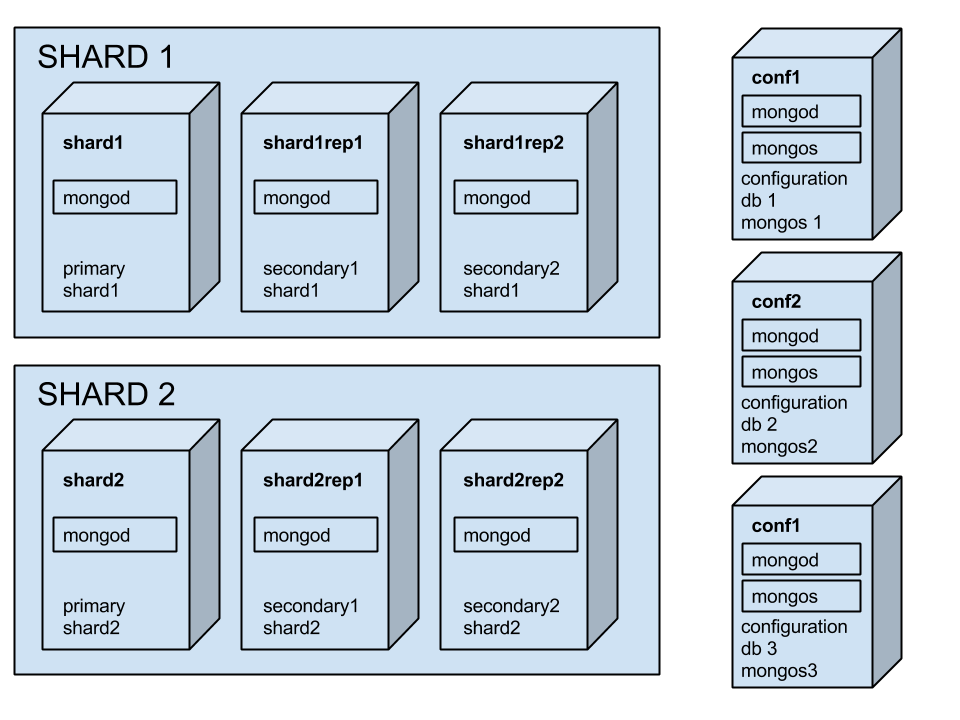

About VAGRANT provisioning
==========================

Vagrant provides easy to configure, reproducible, and portable work environments
built on top of industry-standard technology and controlled by a single
consistent workflow to help maximize the productivity and flexibility of you and
your team.

Installing
==========

You can find the official documentation on the
https://docs.vagrantup.com/v2/installation/index.html page.
It's important to note that we use the Version 2 of Vagrant.

In brief you just want to download and run the installer from
https://www.vagrantup.com/downloads for you platform.

The Vagrant machines that we creates stays on top of the VirtualBox virtualizer.
So it's needed to be already installed. The full documentation is available on
https://www.virtualbox.org/manual/ch02.html

In brief you just need to download and run the binary installer from
https://www.virtualbox.org/wiki/Downloads for you platform.

Creating
========

To run the creation of the machines you just run::

    $ ./create_cluster.sh

.. note::

    This will ask you to choose the network interface to bridge the
    virtualization.
    The steps that will execute are:
    
      * Download the correct version of mongodb
      * If not present will download the correct version of the guest OS
      * Create the virtual machines
      * Install mongodb on each machine
      * Configure the mongodb cluster replicating the current staging deployment
        (2 shards composed by 3 replicated mongod, 3 configdb that runs with 3
        mongos)
      * Uploads and run the setup scripts (.js and .sh) to setup the replicaSets
        and the shards
      * Runs all the instances in the correct order
      * Forward mongos port (30000, 40000, 50000) on your localhost
      
Running
========

To run the cluster you just run::

    $ ./run_cluster.sh

.. note::

    This will ask you to choose the network interface to bridge the
    virtualization.
    The steps that will execute are:
    
      * Run the virtual machines
      * Runs all the instances in the correct order
      
Halting
=======

To halt the cluster you just run::

    $ ./halt_cluster.sh

.. note::

    The steps that will execute are:
    
      * Shut down all the instances in the correct order
      * Halt the virtual machines
      
Restore with mongorestore and enable shard on db
================================================

If you want to restore mongo dumps you can simple put dumps folder (at least 
DB_SUPPORT and one tenant db) inside supporting_files/dbs folder,
then just run ./restore_db.sh, this enable for sharding each tenant dbs

Working with Vagrant
====================

Once the machines are up and running it is possible to ssh into each one by
giving the following command::

    $ vagrant ssh machine_name

The machines preconfigured names are:

 * shard1
 * shard1rep1
 * shard1rep2
 * shard2
 * shard2rep1
 * shard2rep2
 * conf1
 * conf2
 * conf3

The default image OS configure is a Ubuntu 14.04 LTS / 64bit.
The default credentials are:

  user: vagrant
  pass: vagrant
  
The user has ability to sudo su.

.. note::
    If you want to normally ssh to the machines you can by run ssh on localhost.
    The vagrant machines does a port forward for each machine usually on the
    2222 and from 2200..2207 port of your localhost machine

    EXAMPLE::

    $ ssh vagrant@127.0.0.1 -p 2222

Configuration and logs
======================

All the virtual machines have a configuration directory that holds, the custom
configuration of mongodb and one `boostrap_machine.sh` file that contains the
commands to run after the virtual machine creation to setup correctly the
machine.

Logs directory is the same, for each machine when runs a file called
`machine.log` will be created and the logs of the mongodb node will be appended.

.. note::
    This configuration folders are shared with the host machines, so when up and
    running if you change the files inside the configuration of the machines
    will change. So it is easy to change configuration at runtime without ssh
    the host machines. But you must pay attention to what you are doing.

Destroy and cleaning
====================

To destroy all the machines you can run the following command::

    $ ./destroy_cluster

That removes all the created virtual machines and removes the mongodb downloaded
files.

To clean the log files just run::

    $ ./clear_logs
